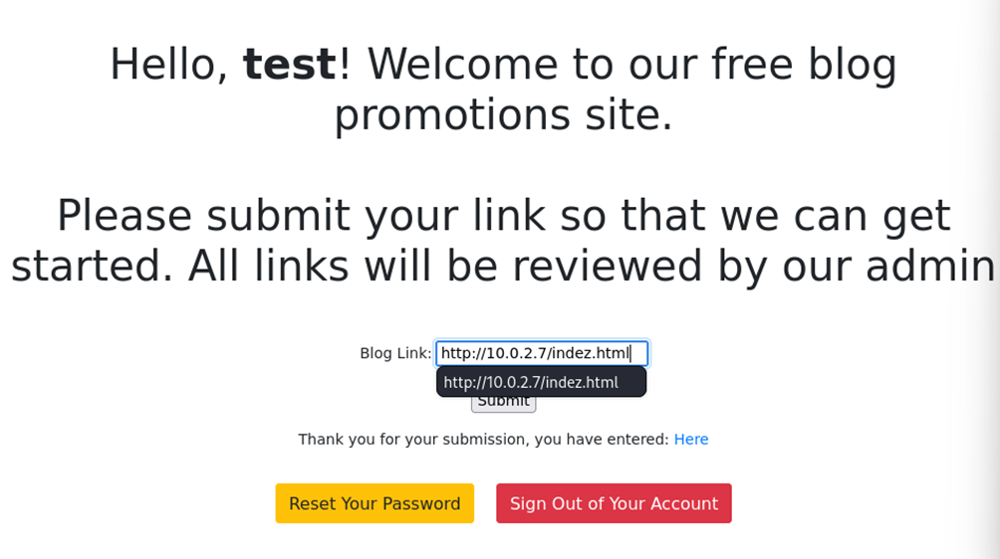
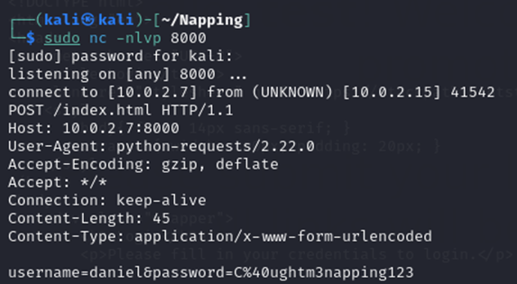

# REPORT DEMO CYBERSECURITY: Vunlhub Napping
**CECILIA COMAR IN2000243**

## Introduction
Napping is a Vulnhub machine created for highlighting the exploit of Tab Nabbing.
Tab Nabbing is a type of phishing attack where a malicious website or script alters the content of a browser tab after 
the user has navigated away from it, typically to another tab or application. The altered content often mimics a 
legitimate website, tricking users into entering their credentials or other sensitive information.
In this report a Tab Nabbing attack will be performed to phish some credentials from an administrator.
Then, thanks to the bad practice followed by this user to use the same credential also for SSH, it will be possible to 
enter into the machine using the SSH protocol.
Due to a sudo misconfiguration it will be possible also to perform privilege escalation obtaining root access to the machine.

## Scan of the network
First of all the command *hostname -I* has to be performed in order to discover the IP address of the machine from which the attacker is working.  
Then the network has to be scanned in order to find other machines in it: this can be done with the command *sudo nmap -v --min-rate 10000 10.0.2.3-254 | grep open*.  
The output of the scan tells that in the network there is a system with IP address *10.0.2.15* which has as open ports:
* port 80 on which is running a http service
* port 22 on which is running an ssh service

This is the targeted vulnerable machine.
A more accurate analysis of the IP address *10.0.2.15* is performed with the command *sudo nmap -v -sV -sC -oN nmap 10.0.2.15 -p-* where:
* thanks to the option *-sV* *nmap* will try to determinate the exact version of the services running on the open ports
* the option *-oN nmap* saves the output of the scanning in a file named nmap and in this way there is a register of the results of the scan.

From the output of this command 2 relevant things can be observed:
1. on the port 22 is running the process OpenSSH
2. on the port 80 is running the process Apache http

Since much can't be done with SSH, a look to the Website is taken.

## Web Page
The web page related to the IP address *10.0.2.15* shows a Login page:
once an account is created (with any username and password), after the login, a free blog promotions site appears.  
I chose as username *test* and as password *password*.
Any link can be here submitted and when this is done, it is displayed on the site for us to check out: 
if as link is inserted the IP address of the machine from which the attacker is working (in my case *10.0.2.7*) a new page is opened at a new tab 
as shown.  
Looking at the source code of the previously displayed login page, this particular URL link functionality on the site is vulnerable to Tab Nabbing:

## Tab Nabbing
A malicious website opened through *target='_blank'* can change the *window.opener.location* to a phising page, potentially misleading users. 
Since users usually trust the page that is already opened, they will not get suspicious.
The idea of the attack is this: since the site indicates that the admin of the page will review the links, it is assumable that he will be clicking on that link as well. 
If the admin is tricked into thinking that he got logged out, then he will input his credentials again but this time it will be in the attacker-controlled page.  
The next step to perform in order to implement this idea, is writing the exploit.

## Exploit construction
The first thing to do is to create a file coping the source code of the login page.  I called this file *index.html*.  
The second step to perform is to write the payload in a different file:
  
I found the syntax for constructing this payload searching on Internet.

## Phished Credentials
In order to phish some credentials, need to be started:
* a TCP server on port 8000: done with the command *sudo nc -nlvp 8000* 
* an HTTP server on port 80:  once the command *sudo python3 -m http.server 80* has been performed, the HTTP server will serve the files in the 
current directory on port 80 to the users that will connect on this system's port.  
The operations that need to be performed are as follows: 
1. into the page obtained after the login, submit the link pointing to the malicious html

2. click on the link: it opens the malicious webpage 
3. after a few moments looking at the output of the *nc* command the username and password of a user
are received:  
  
This credential can be used for login into the vulnerable machine via ssh.

# Discovery
At this point a good idea is looking around in the system: some useful information that can be obtained is
* groups to which the user daniel belong: with the command *id* is discovered that daniel is part of the administrators group!
* interesting files at which daniel has access: with the command *find / group -administrators -type f 2>/dev/null*  
where the option *'2>/dev/null'* redirects any error messages to */dev/null*, which is 
a special device in Linux that discards everything sent to it. This prevents 
error messages related to directories that are not accessible from being displayed. With
this command all files owned by the administrators group are being searched starting 
from the root of the file system.  
An interesting file found is the Python script *query.py* which appears to check the status of the 
Web Server and then writing in the file *site_status*.
By checking the rights of this file with the command *ls -l /home/adrian/query.py* it is discovered
that the user daniel has write permissions on it because he belongs to the administrators group
and by analysing the content of the file *site_status.txt* with the *cat* command it appears that this file is executed every 2 minutes.  

# Privilege Escalation
All this gathered information can be used to perform Privilege Escalation. The idea is the 
one that follows:
1. in the directory */dev/shm* will be created a reverse shell bash script. This directory
is chosen because it is a system directory in Linux that serves as shared memory temporary 
file system: files created in this folder are visible to all system processes, which makes
them useful for temporary data exchange between processes

2. the query *query.py* is modified to execute this reverse shell:

3. a TCP server needs to be started from kali machine: after a few minutes the reverse shell is obtained

Checking the permissions of the user Adrian, what is discovered is that *Vim* can be executed as root without
needing to know the password (case of violation of the principle of Least Privilege) and thanks to what is explained by Gtfobins the root access can be obtained with the command *sudo /usr/bin/vim -c ':!/bin/sh'*:  

      

